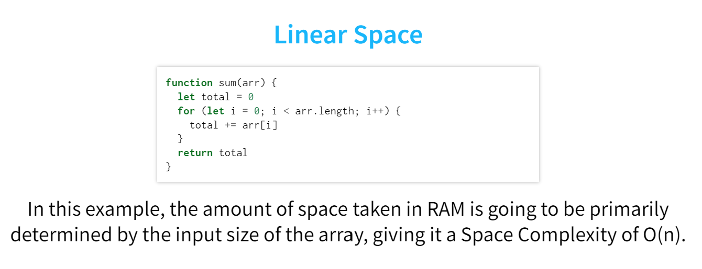

This example is incorrect. Array parameters are simply another reference to the value of the array, and as such do not take up any space. 

Therefore, the only things taking up space in this function are the variables `total` and `i`. These are both numbers that will always use 4 bytes, so the space complexity of this function is O(1).

An example of linear space would be as follows:
```
function sum(arr){
    let doubleNums = []
    for(let i = 0; i < arr.length; i++){
        doubleNums.push(arr[i] * 2)
    }
}
```

In the above function, we are declaring a new array which will use its own memory space. Since the amount of space taken up by `doubleNums` will be determined by the length of the `arr` parameter, the space to workload relationship is linear. O(n) space complexity. 